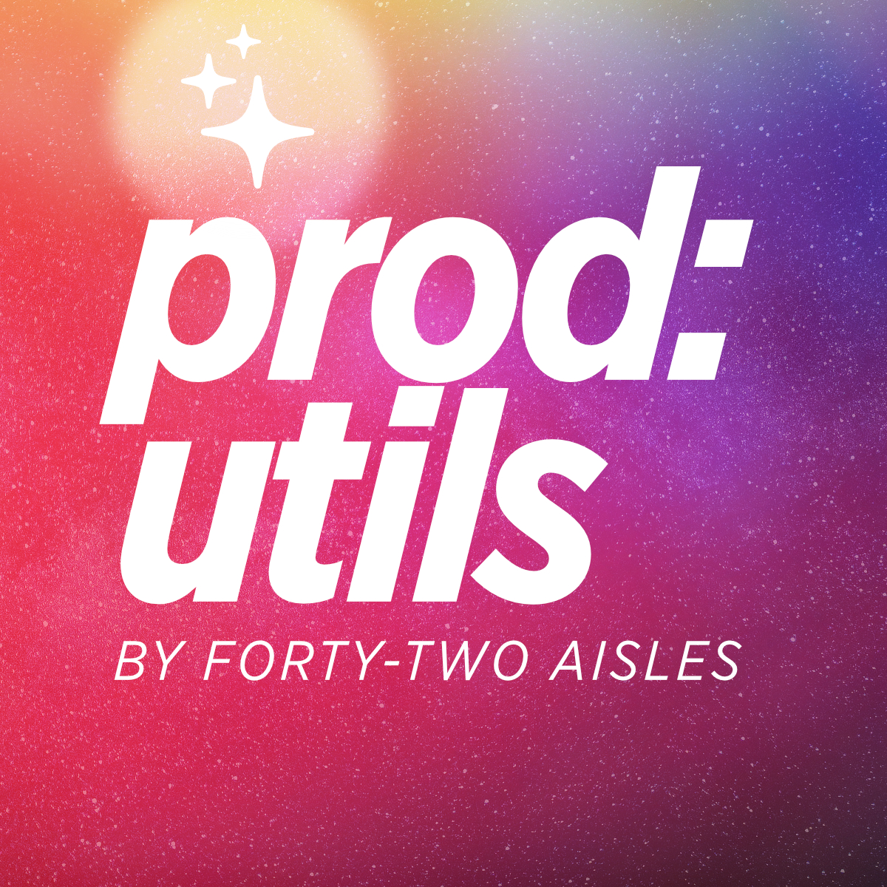

# Producer utilities: Ableton stems renamer

[https://linktr.ee/fortytwoprod](https://linktr.ee/fortytwoprod)

This program helps you clean up the names of your Ableton stem files by removing prefixes and numbers from the file names in a folder and all its subfolders. 

## Setup tutorial

1. [Install Python](https://www.python.org/downloads/), the programming language used for this tool.
2. Install [Visual Studio Code](https://code.visualstudio.com/), which provides an interface to run this program.
3. Download the code by clicking the green "Code" button on this page and selecting "Download ZIP".
4. Decompress the ZIP file as a folder.
5. Open Visual Studio Code, click "File" in the menu bar, select "Open Folder...", select the folder and click "Open" on macOS or "Select Folder" on Windows.
6. In Visual Studio Code, open the file "renamer_ableton.ipynb".

To run the code, follow these steps:

1. Set the `folder_path` variable to the path of the folder containing your Ableton stem files.
    - **On macOS**: Right-click on the folder and select "Get Info". Under the "General" section, highlight the text to the right of "Where" and press Command+C to copy the path. In the file "renamer_ableton.ipynb", find the line that says `folder_path =` and replace the existing path with the one you copied. Make sure to add a `/` at the end and type the folder name afterwards.
    - **On Windows**: Right-click on the folder and select "Properties". Under the "General" tab, highlight the text to the right of "Location" and press Ctrl+C to copy the path. In the file "renamer_ableton.ipynb", find the line that says `folder_path =` and replace the existing path with the one you copied. Make sure to add a `\` at the end and type the folder name afterwards.
2. Set the `prefix` variable to the prefix you want to remove from the file names.
3. Click "Run All" to execute the notebook.
    - If a "Select kernel" dialog box appears at the top of the window, click on the first option.
    - If a pop-up asks to install an ipykernel, select "Install".

## The MIT License

Copyright 2025 Forty-Two Aisles

Permission is hereby granted, free of charge, to any person obtaining a copy of this software and associated documentation files (the “Software”), to deal in the Software without restriction, including without limitation the rights to use, copy, modify, merge, publish, distribute, sublicense, and/or sell copies of the Software, and to permit persons to whom the Software is furnished to do so, subject to the following conditions:

The above copyright notice and this permission notice shall be included in all copies or substantial portions of the Software.

THE SOFTWARE IS PROVIDED “AS IS”, WITHOUT WARRANTY OF ANY KIND, EXPRESS OR IMPLIED, INCLUDING BUT NOT LIMITED TO THE WARRANTIES OF MERCHANTABILITY, FITNESS FOR A PARTICULAR PURPOSE AND NONINFRINGEMENT. IN NO EVENT SHALL THE AUTHORS OR COPYRIGHT HOLDERS BE LIABLE FOR ANY CLAIM, DAMAGES OR OTHER LIABILITY, WHETHER IN AN ACTION OF CONTRACT, TORT OR OTHERWISE, ARISING FROM, OUT OF OR IN CONNECTION WITH THE SOFTWARE OR THE USE OR OTHER DEALINGS IN THE SOFTWARE.